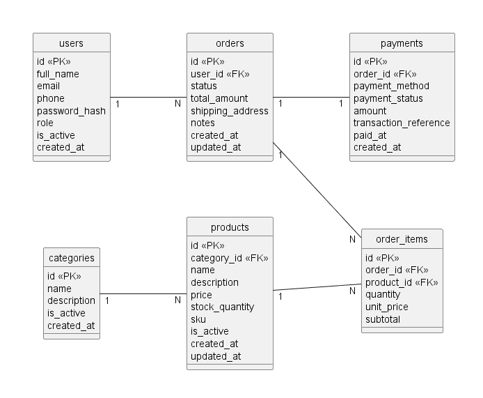
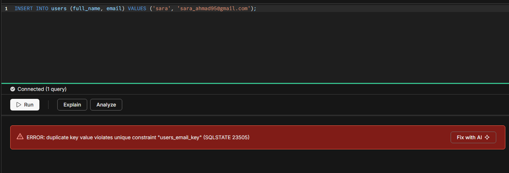
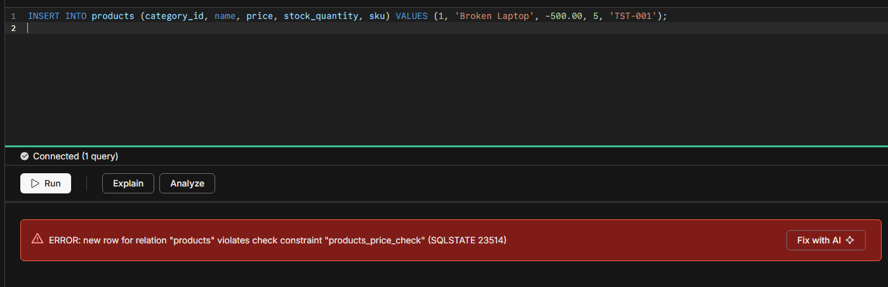
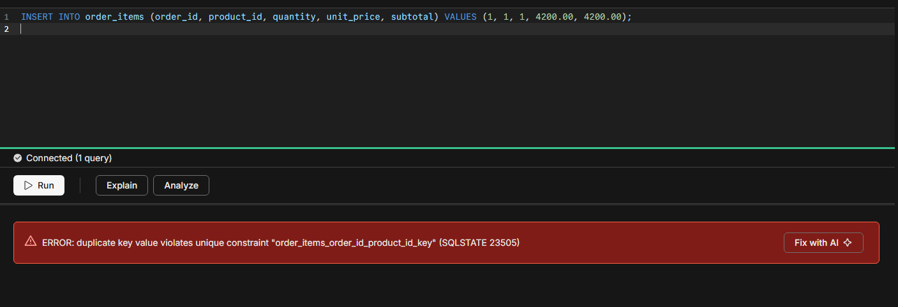

# قاعدة بيانات متجر إلكتروني - التاسك التدريبي الأول

## معلومات الطالب

- **الاسم الرباعي:** البيلسان مصلح فلاح الضمور
- **الرقم الجامعي:** 120222231108
- **البرنامج:** برنامج التدريب العملي - BATMAN TECHNOLOGY
- **المرحلة:** المرحلة الأولى - تصميم وتنفيذ قاعدة بيانات متجر إلكتروني باستخدام Neon PostgreSQL

## وصف المشروع

هذا المشروع عبارة عن قاعدة بيانات لمتجر إلكتروني يبيع الأجهزة والإكسسوارات التقنية مثل
اللابتوبات والهواتف والسماعات ولوحات المفاتيح والشواحن والساعات الذكية وملحقات الألعاب.

تحفظ قاعدة البيانات معلومات العملاء والتصنيفات والمنتجات والطلبات وتفاصيل كل طلب وعمليات
الدفع. الهدف الأساسي هو تنظيم البيانات ومنع التكرار ومنع دخول بيانات غير منطقية، مثل سعر
سالب أو طلب لمستخدم غير موجود.

## الجداول

| الجدول | وظيفته |
|---|---|
| `users` | حسابات المتجر (العملاء والأدمن)، ولكل مستخدم بريد إلكتروني غير مكرر. |
| `categories` | تصنيفات المنتجات مثل Computers و Phones و Accessories و Audio و Gaming. |
| `products` | المنتجات مع السعر وكمية المخزون ورمز المنتج والتصنيف الذي ينتمي إليه. |
| `orders` | الطلبات التي ينشئها المستخدمون، مع الحالة والإجمالي وعنوان التوصيل. |
| `order_items` | المنتجات داخل كل طلب، مع الكمية وسعر الوحدة وقت الشراء. |
| `payments` | عملية الدفع الخاصة بكل طلب، مع الطريقة والحالة والمبلغ. |

## العلاقات

| العلاقة | النوع | التفسير |
|---|---|---|
| `users` ← `orders` | واحد إلى متعدد | المستخدم الواحد يمكنه إنشاء عدة طلبات. |
| `categories` ← `products` | واحد إلى متعدد | التصنيف الواحد يحتوي على عدة منتجات. |
| `orders` ← `order_items` | واحد إلى متعدد | الطلب الواحد يحتوي على عدة عناصر. |
| `products` ← `order_items` | واحد إلى متعدد | المنتج الواحد يمكن أن يظهر في عدة طلبات. |
| `orders` ← `payments` | واحد إلى واحد | كل طلب له عملية دفع واحدة فقط، لأن `order_id` مضبوط UNIQUE. |

العلاقة بين `orders` و `products` هي علاقة متعدد إلى متعدد، لذلك استخدمت جدول `order_items`
كجدول وسيط. هذا الجدول يحفظ أيضاً `quantity` و `unit_price`، وبهذه الطريقة تبقى الفاتورة
القديمة صحيحة حتى لو تغير سعر المنتج لاحقاً في جدول `products`.

مخطط العلاقات موجود في ملف `erd.png`.

رسمت المخطط باستخدام Visio: كل جدول عبارة عن مستطيل بسيط يحتوي على
أسماء الأعمدة مع تحديد المفتاح الأساسي `PK` والمفتاح الخارجي `FK`، وبين الجداول خطوط مكتوب
عليها `1` و `N` لتوضيح نوع العلاقة.



## أهم القيود المطبقة

- `PRIMARY KEY` على عمود `id` في كل جدول.
- `FOREIGN KEY` على `products.category_id` و `orders.user_id` و `order_items.order_id`
  و `order_items.product_id` و `payments.order_id`.
- `UNIQUE` على `users.email` و `categories.name` و `products.sku` و
  `payments.transaction_reference` و `payments.order_id`، وعلى الزوج
  (`order_items.order_id`, `order_items.product_id`) حتى لا يتكرر المنتج نفسه داخل الطلب نفسه.
- `CHECK` على `products.price > 0` و `products.stock_quantity >= 0` و
  `order_items.quantity > 0` و `order_items.unit_price > 0` و
  `order_items.subtotal = quantity * unit_price` و `orders.total_amount >= 0` و
  `payments.amount > 0`، وعلى القيم المسموحة في `role` و `status` و `payment_method`
  و `payment_status`.
- `DEFAULT` على `role` = `customer` و `is_active` = `TRUE` و `status` = `pending`
  و `created_at` = `CURRENT_TIMESTAMP`.
- `NOT NULL` على الحقول الإجبارية مثل `full_name` و `email` و `products.name`
  و `products.price` و `orders.shipping_address`.
- `ON DELETE RESTRICT` على `products.category_id`، حتى لا يمكن حذف تصنيف يحتوي على منتجات.

## طريقة التشغيل

1. إنشاء حساب على [Neon](https://neon.tech) ثم إنشاء مشروع جديد باسم `ecommerce_training`
   باستخدام PostgreSQL.
2. فتح **SQL Editor** من لوحة تحكم Neon.
3. تشغيل `SELECT version();` للتأكد من نجاح الاتصال.
4. نسخ محتوى ملف `01_create_tables.sql` كاملاً والضغط على **Run**. هذا ينشئ الجداول الستة
   مع جميع المفاتيح والقيود.
5. نسخ محتوى ملف `02_insert_sample_data.sql` كاملاً والضغط على **Run**. هذا يدخل البيانات
   التجريبية.
6. فتح قسم **Tables** في Neon والتأكد من ظهور الجداول الستة والبيانات بداخلها.

الملفات يجب أن تُشغّل بهذا الترتيب بسبب المفاتيح الخارجية:
`users` ثم `categories` ثم `products` ثم `orders` ثم `order_items` ثم `payments`.

إذا احتجت البدء من جديد على قاعدة بيانات فارغة، شغّل هذا الأمر أولاً:

```sql
DROP TABLE IF EXISTS payments, order_items, orders, products, categories, users;
```

> **ملاحظة:** يجب الضغط على زر **Run** فقط. أزرار **Explain** و **Analyze** تضيف الأمر
> `EXPLAIN` قبل الاستعلام، وهذا الأمر لا يعمل مع `CREATE TABLE` ويعطي خطأ في الصياغة.

## البيانات التجريبية

| الجدول | عدد السجلات | ملاحظات |
|---|---|---|
| `users` | 8 | أدمن واحد و7 عملاء. المستخدم `Rana Ziad Khoury` بدون أي طلبات. |
| `categories` | 5 | Computers و Phones و Accessories و Audio و Gaming. |
| `products` | 20 | موزعة على التصنيفات الخمسة. المنتجان `Apple Watch SE` و `Blue Yeti Microphone` مخزونهما صفر. |
| `orders` | 10 | حالات متنوعة: pending و confirmed و processing و shipped و delivered وطلب ملغي واحد. |
| `order_items` | 25 | كل طلب يحتوي على عنصر واحد على الأقل. |
| `payments` | 8 | طرق دفع متنوعة: cash و card و bank_transfer و wallet، وحالات: paid و pending و failed و refunded. الطلبان رقم 6 و 9 بدون دفع. |

قيمة `total_amount` في كل طلب تساوي مجموع `subtotal` لعناصره.

في الطلب رقم 2 تم شراء الـ iPhone 15 بسعر `4990.00` بينما سعره الحالي في جدول `products`
هو `5299.00`، وهذا يوضح سبب حفظ `unit_price` داخل `order_items`.

## اختبارات سلامة قاعدة البيانات

جربت إدخال بيانات خاطئة عن قصد للتأكد من أن القيود تمنعها، وصور النتائج موجودة في
مجلد `screenshots/`.

| # | حالة الاختبار | القيد الذي منعها | الصورة |
|---|---|---|---|
| 1 | مستخدم ببريد إلكتروني مكرر | `users_email_key` - UNIQUE | `error1.png` |
| 2 | منتج بسعر سالب | `products_price_check` - CHECK | `error2.png` |
| 3 | منتج بمخزون سالب | `products_stock_quantity_check` - CHECK | `error3.png` |
| 4 | طلب لمستخدم غير موجود | `orders_user_id_fkey` - FOREIGN KEY | `error4.png` |
| 5 | عنصر لطلب غير موجود | `order_items_order_id_fkey` - FOREIGN KEY | `error5.png` |
| 6 | كمية تساوي صفر | `order_items_quantity_check` - CHECK | `error6.png` |
| 7 | تكرار المنتج داخل الطلب نفسه | `order_items_order_id_product_id_key` - UNIQUE مركب | `error7.png` |
| 8 | حالة طلب غير معتمدة | `orders_status_check` - CHECK | `error8.png` |
| 9 | دفعة بمبلغ سالب | `payments_amount_check` - CHECK | `error9.png` |
| 10 | حذف تصنيف مرتبط بمنتجات | `products_category_id_fkey` - RESTRICT | `error10.png` |

### شرح ثلاث حالات

**1. بريد إلكتروني مكرر**



القيد الذي منع العملية هو `users_email_key` وهو قيد `UNIQUE` على عمود `email`. المنع صحيح
لأن البريد الإلكتروني هو وسيلة تسجيل الدخول، ولو تكرر لأصبح هناك أكثر من حساب بنفس البريد
ولن يعرف النظام صاحب الطلبات.

**2. سعر منتج سالب**



القيد الذي منع العملية هو `products_price_check` وهو قيد `CHECK (price > 0)`. المنع صحيح
لأن السعر السالب غير منطقي، ولو تم قبوله لأصبحت إجماليات الطلبات والتقارير المالية خاطئة.

**3. تكرار المنتج نفسه داخل الطلب نفسه**



القيد الذي منع العملية هو `order_items_order_id_product_id_key` وهو قيد `UNIQUE` مركب على
(`order_id`, `product_id`). المنع صحيح لأن المنتج يجب أن يظهر مرة واحدة فقط في الطلب مع
الكمية المطلوبة، وتكراره في سطرين يجعل حساب الإجمالي غير دقيق.

## الأدوات المستخدمة

- **Neon** - قاعدة بيانات PostgreSQL على السحابة، لإنشاء المشروع وتشغيل ملفات SQL.
- **Neon SQL Editor** - لتشغيل الاستعلامات وأخذ صور الأخطاء.
- **VS Code** - لكتابة ملفات `.sql`.
- **Visio** - لرسم مخطط ERD.

## المشاكل التي واجهتني وحلولها

**المشكلة الأولى:** عند تشغيل الملف داخل Neon ظهر لي خطأ
`syntax error at or near "DROP"`، ولاحظت في رسالة الخطأ أن Neon أضاف
`EXPLAIN (FORMAT JSON, COSTS, BUFFERS, VERBOSE)` قبل الأمر.

**الحل:** كنت أضغط على زر **Explain** بدل زر **Run**. أمر `EXPLAIN` يعمل فقط مع
`SELECT` و `INSERT` و `UPDATE` و `DELETE` ولا يعمل مع `CREATE TABLE` أو `DROP TABLE`.
بعد الضغط على **Run** اشتغل الملف بشكل صحيح.

**المشكلة الثانية:** في البداية شغّلت ملف البيانات قبل إنشاء الجداول فظهر خطأ أن الجدول غير
موجود، كما ظهر لي خطأ مفتاح خارجي عندما حاولت إنشاء جدول `products` قبل جدول `categories`.

**الحل:** رتبت إنشاء الجداول بحيث يكون كل مفتاح خارجي يشير إلى جدول تم إنشاؤه قبله، وشغّلت
الملفات بالترتيب الصحيح.

**المشكلة الثالثة:** قيد `CHECK (subtotal = quantity * unit_price)` رفض بعض السطور لأنني
حسبت الإجمالي الفرعي يدوياً وأخطأت في العملية الحسابية.

**الحل:** أعدت حساب كل `subtotal` وتأكدت أن `total_amount` في كل طلب يساوي مجموع
الـ `subtotal` الخاص بعناصره.

## الأمان

لم أضع رابط الاتصال (Connection String) أو كلمة مرور قاعدة البيانات داخل هذا الملف أو داخل
أي ملف من ملفات المشروع. في المشروع البرمجي تُحفظ هذه المعلومات داخل ملف `.env` غير مرفوع
.
